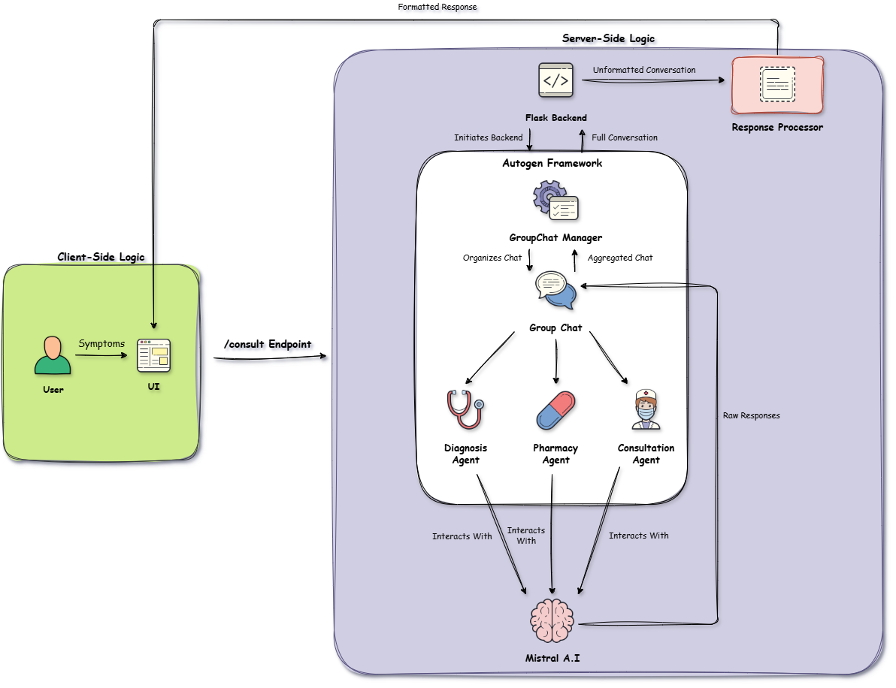

# MedisecAI: Your AI-Powered Medical Assistant

MedisecAI is an intelligent, conversational AI-powered medical assistant designed to provide users with a preliminary medical consultation. By leveraging a multi-agent system, MedisecAI can offer a diagnosis, suggest potential medications, and provide a recommended course of action based on user-provided symptoms.

## ✨ Features

- **Conversational AI Interface:** An intuitive and user-friendly chat interface for a seamless user experience.
- **Multi-Agent System:** Utilizes a team of specialized AI agents for diagnosis, pharmacy recommendations, and consultation.
- **Symptom Analysis:**  Analyzes user-provided symptoms to generate relevant medical information.
- **Dynamic Responses:** Provides formatted and easy-to-understand responses with a typing effect.
- **Error Handling:** Gracefully handles API errors and provides informative feedback to the user.
- **Responsive Design:** Built with Tailwind CSS for a responsive experience across different devices.

## ⚙️ How It Works

MedisecAI processes user queries through a sophisticated multi-agent system built with the `autogen` library. The workflow is as follows:

1.  **User Input:** The user enters their symptoms into the chat interface.
2.  **API Request:** The frontend sends the symptoms to the Flask backend via a POST request to the `/consult` endpoint.
3.  **Agent Initialization:** The Flask application initializes a chat with a team of AI agents:
    *   **Patient Agent:** Represents the user and initiates the conversation.
    *   **Diagnosis Agent:** Analyzes the symptoms and provides a potential diagnosis.
    *   **Pharmacy Agent:** Suggests medications based on the diagnosis.
    *   **Consultation Agent:** Offers a final recommendation and concludes the consultation.
4.  **Agent Conversation:** The agents "discuss" the user's symptoms in a structured, round-robin format.
5.  **Response Generation:** The application captures and parses the entire conversation, formats it into a user-friendly HTML response, and sends it back to the frontend.
6.  **Display Results:** The frontend dynamically displays the AI-generated consultation to the user with a typing effect.

<p align="center">
  
</p>

## 💻 Technologies Used

### Backend


### Frontend


### AI & Other


## 📁 Project Structure

```
.
├── .gitignore
├── app.py
├── Procfile
├── README.md
├── requirements.txt
├── static
│   ├── css
│   │   └── style.css
│   └── js
│       └── script.js
└── templates
    └── index.html
```

## 🚀 Installation

To run MedisecAI locally, follow these steps:

1.  **Clone the repository:**
    ```bash
    git clone https://github.com/your-username/MedisecAI.git
    cd MedisecAI
    ```

2.  **Create and activate a virtual environment:**
    ```bash
    python -m venv venv
    source venv/bin/activate  # On Windows, use `venv\Scripts\activate`
    ```

3.  **Install the dependencies:**
    ```bash
    pip install -r requirements.txt
    ```

4.  **Set up your environment variables:**
    Create a `.env` file in the root directory and add your Mistral AI API key:
    ```
    MISTRAL_API_KEY=your_mistral_api_key
    ```

5.  **Run the application:**
    ```bash
    flask run
    ```
    The application will be available at `http://127.0.0.1:5000`.

## 💡 Usage

1.  Open your web browser and navigate to `http://127.0.0.1:5000`.
2.  Enter your symptoms in the input field (e.g., "fever, cough, and a headache").
3.  Click the "Send" button or press "Enter" to start the consultation.
4.  The AI agents will provide a diagnosis, medication suggestions, and a final recommendation.
5.  Click the "Start New Session" button to begin a new consultation.

## 👋 Contributing

Contributions are welcome! If you have any ideas, suggestions, or bug reports, please open an issue or submit a pull request.

## 📧 Contact

- **Name:** Talha Shafique
- **GitHub:** [https://github.com/talhashafique](https://github.com/talhashafique)
- **Email:** talha.shafique126@gmail.com
